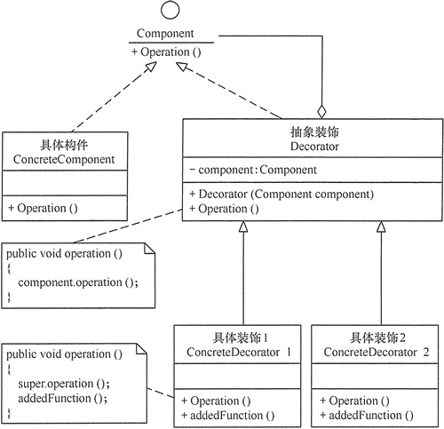

## 装饰模式  
在软件开发过程中，有时想用一些现存的组件。这些组件可能只是完成了一些核心功能。但在不改变其结构的情况下，可以动态地扩展其功能。所有这些都可以釆用装饰模式来实现。
### 装饰模式的定义与特点
装饰（Decorator）模式的定义：指在不改变现有对象结构的情况下，动态地给该对象增加一些职责（即增加其额外功能）的模式，它属于对象结构型模式。

**装饰（Decorator）模式的主要优点有：**
- 装饰器是继承的有力补充，比继承灵活，在不改变原有对象的情况下，动态的给一个对象扩展功能，即插即用
- 通过使用不用装饰类及这些装饰类的排列组合，可以实现不同效果
- 装饰器模式完全遵守开闭原则

**其主要缺点是：装饰模式会增加许多子类，过度使用会增加程序得复杂性。**
###装饰模式的结构
通常情况下，扩展一个类的功能会使用继承方式来实现。但继承具有静态特征，耦合度高，并且随着扩展功能的增多，子类会很膨胀。如果使用组合关系来创建一个包装对象（即装饰对象）来包裹真实对象，并在保持真实对象的类结构不变的前提下，为其提供额外的功能，这就是装饰模式的目标。下面来分析其基本结构和实现方法。

**装饰模式主要包含以下角色。**
- 抽象构件（Component）角色：定义一个抽象接口以规范准备接收附加责任的对象。
- 具体构件（ConcreteComponent）角色：实现抽象构件，通过装饰角色为其添加一些职责。
- 抽象装饰（Decorator）角色：继承抽象构件，并包含具体构件的实例，可以通过其子类扩展具体构件的功能。
- 具体装饰（ConcreteDecorator）角色：实现抽象装饰的相关方法，并给具体构件对象添加附加的责任。

装饰模式的结构图如图 1 所示。

