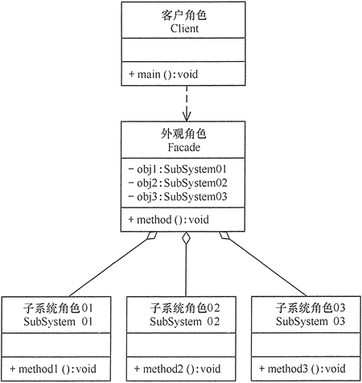

## 外观模式 
### 外观模式的定义与特点
外观（Facade）模式又叫作门面模式，是一种通过为多个复杂的子系统提供一个一致的接口，而使这些子系统更加容易被访问的模式。该模式对外有一个统一接口，外部应用程序不用关心内部子系统的具体细节，这样会大大降低应用程序的复杂度，提高了程序的可维护性。

在日常编码工作中，我们都在有意无意的大量使用外观模式。只要是高层模块需要调度多个子系统（2个以上的类对象），我们都会自觉地创建一个新的类封装这些子系统，提供精简的接口，让高层模块可以更加容易地间接调用这些子系统的功能。尤其是现阶段各种第三方SDK、开源类库，很大概率都会使用外观模式。

外观（Facade）模式是“迪米特法则”的典型应用，它有以下主要优点。
- 降低了子系统与客户端之间的耦合度，使得子系统的变化不会影响调用它的客户类。
- 对客户屏蔽了子系统组件，减少了客户处理的对象数目，并使得子系统使用起来更加容易。
- 降低了大型软件系统中的编译依赖性，简化了系统在不同平台之间的移植过程，因为编译一个子系统不会影响其他的子系统，也不会影响外观对象。

外观（Facade）模式的主要缺点如下。
- 不能很好地限制客户使用子系统类，很容易带来未知风险。
- 增加新的子系统可能需要修改外观类或客户端的源代码，违背了“开闭原则”。
### 外观模式的结构
外观（Facade）模式的结构比较简单，主要是定义了一个高层接口。它包含了对各个子系统的引用，客户端可以通过它访问各个子系统的功能。现在来分析其基本结构和实现方法。
**外观（Facade）模式包含以下主要角色。**
- 外观（Facade）角色：为多个子系统对外提供一个共同的接口。
- 子系统（Sub System）角色：实现系统的部分功能，客户可以通过外观角色访问它。
- 客户（Client）角色：通过一个外观角色访问各个子系统的功能。

